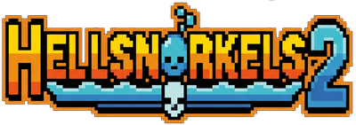
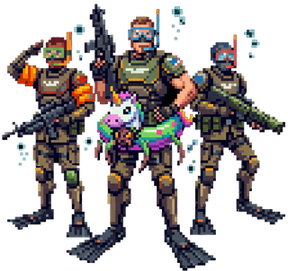

<p align="center">
  
</p>

<h3 align="center"><em>¡Managed Democracy needs YOU... to snorkel into bug territory!</em></h3>

<p align="center">
  Un fan-juego gratuito y sin ánimo de lucro inspirado en <strong>HELLDIVERS 2</strong>, con estética retro estilo NES/SNES.<br>
  Juega desde el navegador, sin instalar nada.
</p>

<p align="center">
  <a href="http://HellSnorkels2.olavarria.es"></a>
</p>

---

<p align="center">
  
</p>

---

> Si has llegado hasta aquí, seguramente ya conozcas **HELLDIVERS 2**. Si no es así, te lo recomendamos: es increíble. Nosotros estamos enganchados. Y mucho. Y cada vez que pensamos que ya hemos salido del bucle, nos ponemos "una partidita más" y volvemos a caer.

---

## Contenido

| | |
|---|---|
| **Plataforma** | Navegador web (PC, móvil, tablet) |
| **Controles** | Teclado + ratón / Mando Xbox / Táctil |
| **Biomas** | Lunar, Desértico, Boscoso, Volcánico |
| **Dificultades** | 7 niveles (Tirado → Helldiver) |
| **Armas** | Ametralladora, Pistola, Comando, Granadas, Combo cuerpo a cuerpo |
| **Stratagems** | Guard Dog, Orbital Laser, Eagle Cluster, Jump Pack, Lanz Cohetes, Suministros |

---

## Cómo jugar

1. Abre el enlace en tu navegador
2. Selecciona dificultad y planeta
3. Destruye todos los nidos de criaturas marinas
4. ¡Extracción en el centro del mapa!

### Controles

Se han mantenido los mismos controles que **HELLDIVERS 2** tanto en teclado como en mando Xbox.

| Acción | Teclado | Mando |
|--------|---------|-------|
| Mover | WASD | Left Stick |
| Apuntar | Ratón | Right Stick |
| Disparar | Click izquierdo | RT |
| Granada | G | RT (con granada equipada) |
| Melee | F | RB (tap) |
| Recargar | R | X |
| Interactuar | E | A |
| Sprint | Shift | RB (hold) |
| Usar stim | V | D-Pad ↑ |
| Saltar (Jump Pack) | Espacio | A |
| Cambiar arma | 1-4 | Y (tap: 1↔2, hold ≥1s: 3) / D-Pad → (4) |
| Stratagem (abrir) | Ctrl | LB |
| Stratagem (flechas) | WASD | D-Pad |
| Stratagem (confirmar) | Click / RT | RT |
| Stratagem (cancelar) | Esc / Ctrl | LB / B |
| Pausa | Esc | Start |
| Música on/off | M | Select |

---

## Arquitectura

```
index.html          → Router (redirige a mobile o desktop)
desktop.html        → Wrapper escritorio
mobile.html         → Wrapper móvil
game.js             → Motor compartido (~3000 líneas)
input-desktop.js    → Entrada teclado + ratón + mando
input-mobile.js     → Táctil (Virtual GamePad)
```

---

## Estratagemas

| Nombre | Secuencia | Efecto |
|--------|-----------|--------|
| Guard Dog | ↓↑↑→↓↓ | Drone de combate autónomo |
| Orbital Laser | →↓↑→↓ | Láser orbital (10s) |
| Eagle Cluster | ↑→↓↓→ | Ataque aéreo con clúster |
| Jump Pack | ↓↑↑↓ | Impulso vertical |
| Lanz Cohetes | ↓←→→← | Lanzacohetes portátil |
| Suministros | ↓↓↑→ | Munición + salud + granadas |

---

## ¿Cómo se ha hecho esto?

Este juego se ha desarrollado íntegramente con **[OpenCode](https://opencode.ai)**, el agente de código abierto para terminal, IDE y escritorio, utilizando únicamente los proveedores de inferencia incluidos en su opción **free**. Ni una sola línea de código escrita a mano, ni un solo commit sin su ayuda. OpenCode es una herramienta brutal, gratuita y con más de 160K estrellas en GitHub. Gracias a todo el equipo de OpenCode por hacer esto posible.

---

## Estado de desarrollo

**HELLSNORKELS 2** está en desarrollo activo. Poco a poco vamos terminando cosas, mejorando otras y corrigiendo bugs. Si encontráis algo raro (más raro de lo esperado), no dudéis en abrir un issue.

---

## Aviso legal

**HELLSNORKELS 2** es un fan-game gratuito y parodia de **HELLDIVERS 2**. No tiene ánimo de lucro y no pretende reemplazar la obra original.

Todos los derechos de **HELLDIVERS 2** pertenecen a **Arrowhead Game Studios** y **Sony Interactive Entertainment**.

---

Hecho con ❤️ y muchos errores de segmentation en la psyche humana.
